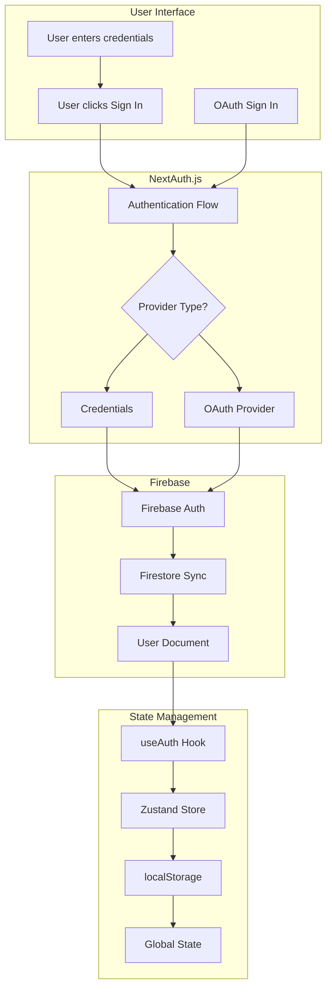

# 🚗 Nacs Car Rental Web Application

A modern car rental web application built with Next.js, Firebase, and TypeScript.

## 🌟 Features

- 🔐 **Multi-Provider Authentication**: Email/Password, Google, Facebook, GitHub
- 🔥 **Firebase Integration**: Authentication, Firestore database, Storage
- 🎯 **State Management**: Zustand with localStorage persistence
- 🎨 **Modern UI**: Tailwind CSS with custom components
- 📱 **Responsive Design**: Mobile-first approach
- 🔒 **Type-Safe**: Full TypeScript implementation
- 🚀 **Next.js 14**: App Router, Server Components, API Routes

## 🔐 Authentication Workflow



[📖 **View Complete Authentication Documentation**](./docs/AUTHENTICATION_WORKFLOW.md)

## 🚀 Quick Start

### Prerequisites

- Node.js 18+ 
- npm or yarn
- Firebase project

### Installation

1. **Clone the repository**
   ```bash
   git clone https://github.com/yourusername/car-rental-web.git
   cd car-rental-web
   ```

2. **Install dependencies**
   ```bash
   npm install
   ```

3. **Set up environment variables**
   ```bash
   cp .env.example .env.local
   ```
   
   Fill in your Firebase and OAuth credentials in `.env.local`

4. **Run the development server**
   ```bash
   npm run dev
   ```

5. **Open your browser**
   Visit [http://localhost:3000](http://localhost:3000)

## 🔧 Configuration

### Firebase Setup

1. Create a Firebase project at [Firebase Console](https://console.firebase.google.com/)
2. Enable Authentication with Email/Password and OAuth providers
3. Create a Firestore database
4. Set up Firebase Storage
5. Copy your Firebase config to `.env.local`

### OAuth Providers

- **Google**: [Google Cloud Console](https://console.cloud.google.com/)
- **Facebook**: [Facebook Developers](https://developers.facebook.com/)
- **GitHub**: [GitHub Developer Settings](https://github.com/settings/developers)

## 📁 Project Structure

```
├── app/                    # Next.js App Router
│   ├── [lang]/            # Internationalization
│   ├── api/               # API Routes
│   └── test-firebase/     # Authentication testing
├── components/            # Reusable UI components
│   ├── auth/             # Authentication forms
│   ├── ui/               # Base UI components
│   └── partials/         # Layout components
├── lib/                  # Utility libraries
│   ├── firebase.ts       # Firebase configuration
│   ├── auth.ts           # NextAuth configuration
│   └── user-utils.ts     # User data utilities
├── hooks/                # Custom React hooks
├── store/                # Zustand state management
├── provider/             # React context providers
└── docs/                 # Documentation
```

## 🎯 State Management

The application uses **Zustand** for global state management with the following features:

- 💾 **Persistent storage** with localStorage
- 🔄 **Automatic user data loading** after authentication
- 🎪 **Type-safe** state management
- 🚀 **Optimistic updates** and caching

```typescript
// Example usage
import { useUserStore } from '@/store';

function MyComponent() {
  const { user, updateUser } = useUserStore();
  
  return (
    <div>
      <p>Welcome, {user?.firstName}!</p>
      <p>Role: {user?.role}</p>
      <p>KYC Status: {user?.kycRecord.status}</p>
    </div>
  );
}
```

## 🧪 Testing Authentication

Visit `/test-firebase` to test the complete authentication flow:

- ✅ NextAuth session management
- ✅ Firebase authentication  
- ✅ Firestore data synchronization
- ✅ Zustand state management
- ✅ localStorage persistence

## 🎨 UI Components

Built with modern UI components:

- **Shadcn/ui**: Base component library
- **Tailwind CSS**: Utility-first styling
- **Lucide Icons**: Modern icon set
- **React Hook Form**: Form validation
- **Zod**: Schema validation

## 📚 Documentation

- [🔐 Authentication Workflow](./docs/AUTHENTICATION_WORKFLOW.md)
- [🔥 Firebase Setup Guide](./FIREBASE-SETUP.md)
- [🎯 State Management](./docs/STATE_MANAGEMENT.md)

## 🤝 Contributing

1. Fork the repository
2. Create a feature branch (`git checkout -b feature/amazing-feature`)
3. Commit your changes (`git commit -m 'Add some amazing feature'`)
4. Push to the branch (`git push origin feature/amazing-feature`)
5. Open a Pull Request

## 📄 License

This project is licensed under the MIT License - see the [LICENSE](LICENSE) file for details.

## 🙋‍♂️ Support

If you have any questions or need help with setup, please open an issue or contact the development team.

---

**Built with ❤️ using Next.js, Firebase, and TypeScript**