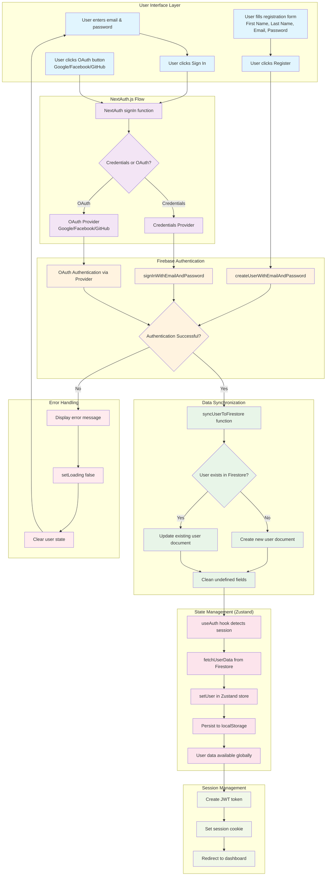
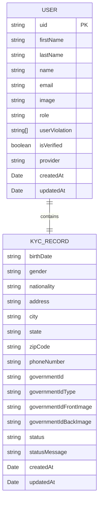
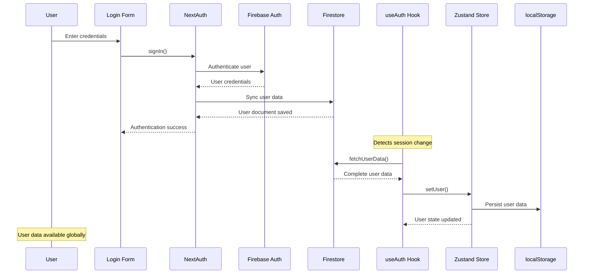

# Nacs Car Rental - Authentication Workflow

This document outlines the complete authentication flow for the Nacs Car Rental Web application, including Firebase integration, NextAuth.js, and Zustand state management.

## Complete Authentication Flow

## User Data Structure

## State Management Flow

## Key Components

### 🔐 Authentication Providers

- **Email/Password**: Firebase Auth with custom credentials
- **Google OAuth**: NextAuth.js Google provider
- **Facebook OAuth**: NextAuth.js Facebook provider
- **GitHub OAuth**: NextAuth.js GitHub provider

### 📊 State Management

- **Zustand Store**: Global user state with persistence
- **useAuth Hook**: Automatic session detection and data loading
- **localStorage**: Persistent user data across sessions

### 🔄 Data Flow

1. User authenticates through any provider
2. NextAuth.js handles authentication flow
3. Firebase stores user credentials
4. Firestore synchronizes user profile data
5. useAuth hook detects session changes
6. Zustand store fetches and persists user data
7. User data available throughout the application

### 🛡️ Security Features

- JWT-based sessions
- Firebase Authentication security
- Firestore security rules
- Automatic session cleanup on signout
- Undefined value sanitization

## Testing

Visit `/test-firebase` to test the complete authentication flow and verify:

- ✅ NextAuth session management
- ✅ Firebase authentication
- ✅ Firestore data synchronization
- ✅ Zustand state management
- ✅ localStorage persistence
